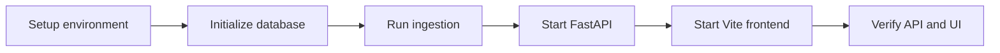

# Project Documentation

UKJob Analytics combines a Python data pipeline, a FastAPI backend, and a React/Vite frontend. It collects technology job listings, preserves source payloads, normalizes the data, computes salary insights, and exposes the results for interactive use.

## Start here



1. Read [setup.md](setup.md) for dependencies, environment variables, database initialization, and local startup.
2. Read [architecture.md](architecture.md) for module ownership and runtime boundaries.
3. Read [data-flow.md](data-flow.md) for record lineage and ingestion behavior.
4. Read [backend/README.md](../backend/README.md) for the complete API contract.

## Repository map

```text
.
├── backend/             FastAPI app, routers, API schemas, and API services
├── data/                Mock input and timestamped bronze snapshots
├── data_pipeline/       Clients, processing, storage, database, scheduler,
│                        ingestion orchestration, and pipeline tests
├── docs/                Project architecture, flow, and setup documentation
├── frontend/            React/Vite application and frontend tooling
└── pyproject.toml       Ruff configuration and Python project tooling
```

## Implemented capabilities

- Adzuna extraction with configurable page and job limits
- Mock-data ingestion for local development
- Immutable timestamped bronze payloads
- DataFrame cleaning, flattening, and salary normalization
- Current listing synchronization with inactive/stale lifecycle handling
- Listing observation history per ingestion run
- Salary insight snapshots with distribution and outlier statistics
- Daily scheduled ingestion at 02:00 UTC when the backend process is running
- FastAPI endpoints for jobs, application tracking, analytics, health, and ingestion monitoring
- React/Vite frontend build, lint, typecheck, and development workflow

## Current maturity

The pipeline and its test suite provide the project’s most established core. The backend is functional and has a documented API, but analytics response models are intentionally flexible while contracts continue to settle. The frontend is an active application layer and should be tested against the running API rather than treated as a static artifact.

## Important boundaries

- `data_pipeline` owns ingestion, transformation, database synchronization, and persisted salary analysis.
- `backend` owns HTTP concerns, serialization, filtering, application tracking, and API-facing analytics queries.
- `frontend` owns presentation and client interaction.
- `data/bronze` is source lineage and should not be treated as the canonical current dataset; the database is the serving store.

## Verification commands

From the repository root:

```bash
python -m pytest data_pipeline/tests
python -m compileall -q backend data_pipeline
```

For the frontend:

```bash
cd frontend
npm run lint
npm run typecheck
npm run build
```

The API’s generated contract is available from a running server at `/docs`, `/redoc`, and `/openapi.json`.
