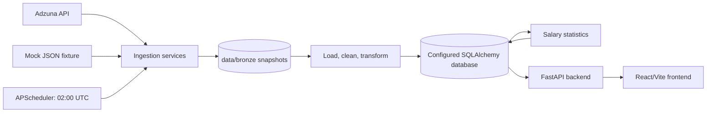
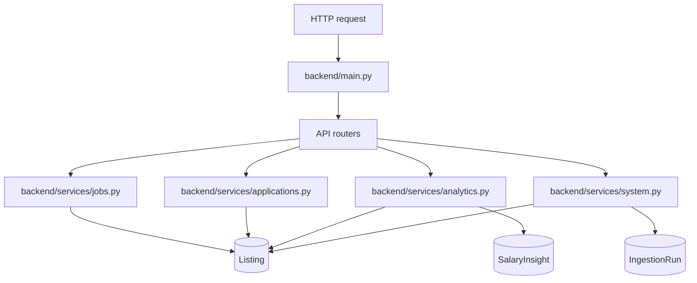

# Architecture

## System boundary

UKJob Analytics is a pipeline-first application with four runtime concerns:

- **Source and storage:** Adzuna data, mock fixtures, and immutable bronze JSON snapshots.
- **Data pipeline:** extraction, cleaning, normalization, synchronization, and salary analysis.
- **API:** a FastAPI read and application-tracking boundary for the frontend.
- **Frontend:** a React/Vite client that presents listings and analytics.



The database URL is configuration-driven. The codebase includes SQLite-oriented
local tooling and models, but deployments should treat `DATABASE_URL` as the
source of truth.

## Runtime components

### Data pipeline

The pipeline owns data acquisition and analytical persistence. Its main
orchestrator is [`data_pipeline/services/pipeline.py`](../data_pipeline/services/pipeline.py),
which:

1. creates an `IngestionRun` record
2. fetches jobs from Adzuna through `AdzunaClient`
3. writes `data/bronze/adzuna_<timestamp>.json`
4. loads the bronze payload into pandas
5. cleans and normalizes job fields
6. upserts `Listing` rows and appends `ListingHistory` observations
7. marks missing or stale listings inactive
8. calculates salary statistics
9. persists a `SalaryInsight` snapshot
10. completes the ingestion run, or records failure details and re-raises

The pipeline deduplicates incoming IDs and prevents duplicate inserts within one run.

### Database

The database layer is defined in [`data_pipeline/database/models.py`](../data_pipeline/database/models.py)
and connected through [`data_pipeline/database/connection.py`](../data_pipeline/database/connection.py).

| Entity           | Responsibility                                                                                              |
| ---------------- | ----------------------------------------------------------------------------------------------------------- |
| `Listing`        | Current canonical job record, normalized salary values, active/inactive lifecycle, and application tracking |
| `ListingHistory` | Per-ingestion observation of listing and salary fields                                                      |
| `SalaryInsight`  | Historical aggregate salary analysis snapshot                                                               |
| `IngestionRun`   | Pipeline counters, status, timestamps, bronze path, and failure message                                     |

`Listing` is the shared boundary between pipeline output and API reads. The
application tracker updates tracking columns on that same entity.

### Processing and storage modules

- [`processing/clean.py`](../data_pipeline/processing/clean.py) cleans source records and handles missing values.
- [`processing/transform.py`](../data_pipeline/processing/transform.py) flattens source objects and produces database-ready fields.
- [`processing/statistics.py`](../data_pipeline/processing/statistics.py) calculates descriptive salary statistics.
- [`storage/raw.py`](../data_pipeline/storage/raw.py) writes bronze snapshots.
- [`storage/bronze_loader.py`](../data_pipeline/storage/bronze_loader.py) loads supported bronze payload shapes.

### Backend

[`backend/main.py`](../backend/main.py) creates the FastAPI app, adds CORS
middleware, maps exceptions into a consistent error envelope, includes the four
router groups, and starts the APScheduler lifecycle during application startup.



The API does not fetch Adzuna data or perform pipeline transformation. It
serializes persisted data and exposes analytics calculations over it.

### Frontend

The frontend is a React 19 and Vite application. Its build, lint, typecheck,
and development commands are defined in [`frontend/package.json`](../frontend/package.json).
It is a separate process from the backend and communicates over HTTP.

## Scheduler behavior

`data_pipeline/database/scheduler/main_scheduler.py` creates a background
APScheduler using UTC and schedules `execute_daily_ingestion` at 02:00 UTC with
`max_instances=1`. The backend starts this scheduler in its FastAPI lifespan.
Multiple API worker processes can therefore create multiple schedulers unless
deployment is configured accordingly.

## Architectural invariants

- Bronze payloads are written before transformation and remain available for reprocessing and debugging.
- `Listing.id` is the identity used for synchronization and history links.
- Successful runs update current listings and create a salary insight; failed runs remain recorded with `status="failed"` and `error_message`.
- Missing listings are inactivated rather than deleted.
- API services open database sessions per operation and do not own schema migrations or ingestion scheduling.

## Current tradeoffs

- Analytics routes use a flexible response marker while their payload contracts evolve.
- The API and scheduler share one process, which is convenient locally but needs deployment discipline when scaling horizontally.
- Environment configuration is loaded from `.env`; secrets should not be committed.
- Pipeline tests exist, while frontend/API integration and deployment hardening remain ongoing work.

# Architecture

## Overview

The project is organized into a layered system whose core analytical engine is already largely complete.

The main architectural layers are:

- data pipeline: the operational core for collecting, cleaning, normalizing, and analyzing job data
- database layer: the persistence layer for listings and salary insight snapshots
- backend: the application/API interface for exposing processed results
- frontend: the presentation layer for end-user access and dashboards
- data: raw and bronze storage for source traceability

## The mature core: data pipeline

The data pipeline is the strongest and most complete part of the repository. It is responsible for the full transformation sequence from source payload to analytical output.

The current pipeline flow is:

1. job data is fetched from a source provider or mock data source
2. the raw payload is saved as a bronze snapshot
3. the bronze JSON is loaded into pandas
4. the dataset is cleaned and normalized
5. salary values are standardized and midpoint values are produced
6. transformed records are written to the listings table
7. descriptive salary statistics are calculated
8. a snapshot of analytics is stored in the salary_insights table

This workflow is executed by [data_pipeline/services/pipeline.py](../data_pipeline/services/pipeline.py).

## Component responsibilities

### Data ingestion and storage

The ingestion and storage layer is responsible for:

- fetching job records from Adzuna or repository fixture data
- saving immutable raw payloads to bronze storage
- preserving source records for auditing and debugging

Relevant implementation areas include:

- [data_pipeline/clients](../data_pipeline/clients)
- [data_pipeline/storage](../data_pipeline/storage)

### Cleaning and normalization

The cleaning and transformation layer ensures records are structurally consistent and ready for analysis. It handles:

- missing-value cleanup
- nested object flattening
- location normalization
- salary standardization
- dtype enforcement

This logic lives primarily in:

- [data_pipeline/processing/clean.py](../data_pipeline/processing/clean.py)
- [data_pipeline/processing/transform.py](../data_pipeline/processing/transform.py)

### Statistical analysis

The statistics engine calculates descriptive metrics and distribution-based summaries for job salary data. It supports:

- mean, median, min, max, standard deviation
- p25, p50, p75 quartiles
- IQR and outlier detection
- range and variance summaries

This logic is implemented in:

- [data_pipeline/processing/statistics.py](../data_pipeline/processing/statistics.py)

### Database layer

The database layer defines the canonical persisted representation of job data and analytics snapshots.

Key persistence objects include:

- Listing: normalized job listings
- SalaryInsight: statistical summary snapshots tied to a run or analysis version

Defined in:

- [data_pipeline/database/models.py](../data_pipeline/database/models.py)
- [data_pipeline/database/connection.py](../data_pipeline/database/connection.py)

### Backend layer

The backend acts as the API-facing layer over the processed project data. It is currently lightweight but is meant to serve the cleaned pipeline output to the frontend or other consumers.

Current implementation:

- [backend/main.py](../backend/main.py)

### Frontend layer

The frontend is a React/Vite interface that is intended to display job analytics and allow user interaction with the processed dataset. It is still under active development.

## Data-flow architecture

The repository currently follows this conceptual flow:

```text
Source data
  -> bronze/raw storage
  -> cleaning and transformation
  -> SQLite listings
  -> salary statistics
  -> salary insight snapshots
  -> backend API
  -> frontend UI
```

## Design strengths

The current architecture is strong for a project at this stage because it keeps the following concerns separated:

- source acquisition
- data storage
- transformation
- database persistence
- analytics
- API access
- UI presentation

This separation makes the pipeline easy to test, debug, and extend.

## Current limitations

The project is not yet a fully finalized production system. Key areas still evolving include:

- API contract standardization in the backend
- UI route structure and dashboard design in the frontend
- environment configuration for non-local deployments
- operational automation and deployment scaffolding

## Recommendation for future work

As the application matures, the team should formalize:

- database schema documentation
- endpoint contract documentation
- environment variable documentation
- deployment process documentation
- frontend-to-backend integration patterns

The pipeline, however, is sufficiently mature that it should be considered the backbone of the project and documented as such.
