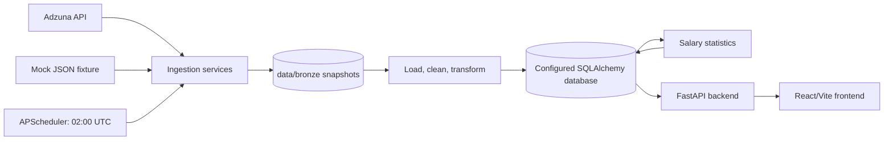
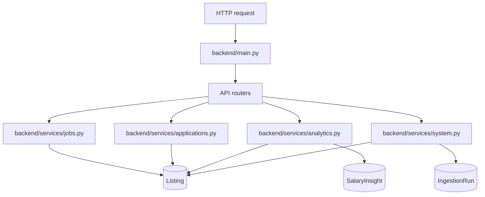

# Architecture

## System boundary

UKJob Analytics is a pipeline-first application with four runtime concerns:

- **Source and storage:** Adzuna data, mock fixtures, and immutable bronze JSON snapshots.
- **Data pipeline:** extraction, cleaning, normalization, synchronization, and salary analysis.
- **API:** a FastAPI read and application-tracking boundary for the frontend.
- **Frontend:** a React/Vite client that presents listings and analytics.

The database URL is configuration-driven. The codebase includes SQLite-oriented
local tooling and models, but deployments should treat `DATABASE_URL` as the
source of truth.

## Runtime components

### Data pipeline

The pipeline owns data acquisition and analytical persistence. Its main
orchestrator is [`data_pipeline/services/pipeline.py`](../data_pipeline/services/pipeline.py),
which:

1. creates an `IngestionRun` record
2. fetches jobs from Adzuna through `AdzunaClient`
3. writes `data/bronze/adzuna_<timestamp>.json`
4. loads the bronze payload into pandas
5. cleans and normalizes job fields
6. upserts `Listing` rows and appends `ListingHistory` observations
7. marks missing or stale listings inactive
8. calculates salary statistics
9. persists a `SalaryInsight` snapshot
10. completes the ingestion run, or records failure details and re-raises

The pipeline deduplicates incoming IDs and prevents duplicate inserts within one run.

### Database

The database layer is defined in [`data_pipeline/database/models.py`](../data_pipeline/database/models.py)
and connected through [`data_pipeline/database/connection.py`](../data_pipeline/database/connection.py).

| Entity           | Responsibility                                                                                              |
| ---------------- | ----------------------------------------------------------------------------------------------------------- |
| `Listing`        | Current canonical job record, normalized salary values, active/inactive lifecycle, and application tracking |
| `ListingHistory` | Per-ingestion observation of listing and salary fields                                                      |
| `SalaryInsight`  | Historical aggregate salary analysis snapshot                                                               |
| `IngestionRun`   | Pipeline counters, status, timestamps, bronze path, and failure message                                     |

`Listing` is the shared boundary between pipeline output and API reads. The
application tracker updates tracking columns on that same entity.

### Processing and storage modules

- [`processing/clean.py`](../data_pipeline/processing/clean.py) cleans source records and handles missing values.
- [`processing/transform.py`](../data_pipeline/processing/transform.py) flattens source objects and produces database-ready fields.
- [`processing/statistics.py`](../data_pipeline/processing/statistics.py) calculates descriptive salary statistics.
- [`storage/raw.py`](../data_pipeline/storage/raw.py) writes bronze snapshots.
- [`storage/bronze_loader.py`](../data_pipeline/storage/bronze_loader.py) loads supported bronze payload shapes.

### Backend

[`backend/main.py`](../backend/main.py) creates the FastAPI app, adds CORS
middleware, maps exceptions into a consistent error envelope, includes the four
router groups, and starts the APScheduler lifecycle during application startup.

The API does not fetch Adzuna data or perform pipeline transformation. It
serializes persisted data and exposes analytics calculations over it.

### Frontend

The frontend is a React 19 and Vite application. Its build, lint, typecheck,
and development commands are defined in [`frontend/package.json`](../frontend/package.json).
It is a separate process from the backend and communicates over HTTP. The current
production frontend is deployed at [tech-job-analytics.vercel.app](https://tech-job-analytics.vercel.app/);
the deployment remains dependent on a reachable backend API and database.

## Scheduler behavior

`data_pipeline/database/scheduler/main_scheduler.py` creates a background
APScheduler using UTC and schedules `execute_daily_ingestion` at 02:00 UTC with
`max_instances=1`. The backend starts this scheduler in its FastAPI lifespan.
Multiple API worker processes can therefore create multiple schedulers unless
deployment is configured accordingly.

## Architectural invariants

- Bronze payloads are written before transformation and remain available for reprocessing and debugging.
- `Listing.id` is the identity used for synchronization and history links.
- Successful runs update current listings and create a salary insight; failed runs remain recorded with `status="failed"` and `error_message`.
- Missing or stale listings are inactivated first; expired listings are deleted by the retention cleanup.
- Active listings can be reactivated when observed again before deletion.
- API services open database sessions per operation and do not own schema migrations or ingestion scheduling.

## Match scoring and personal fit

The prioritization service scores each active listing from 0 to 100 and returns
the total, a `HIGH`/`MEDIUM`/`LOW` label, factor scores, and explanations. The
weighted factors are salary percentile (25%), title relevance (25%), category
preference (15%), location preference (10%), contract-type preference (10%),
salary completeness (10%), and recency (5%). Salary percentile is measured
against active listings with usable normalized midpoint salaries. Recency fades
linearly from 100 for a new listing to 0 at 60 days old.

The saved browser profile supplies target titles, preferred categories,
preferred locations, and preferred contract types. A matching preference scores
100 for that factor; an explicit non-match scores 0. An empty preference is
neutral at 50, so a user can personalize only the dimensions they care about.
Missing salary or an unparseable posting date scores 0 for the affected factor.
This score is a recommendation signal, not a prediction of hiring success.

## Listing lifecycle

New or observed listings are active. A listing becomes inactive when its last
observation is older than `ADZUNA_STALE_AFTER_DAYS`; the cleanup step records
`inactive_at`. A later ingestion can reactivate it and refresh `last_seen_at`.
The same synchronization step deletes inactive listings after
`ADZUNA_MAX_INACTIVE_DAYS_OLD` days (default 7), or active listings not seen for
`ADZUNA_MAX_LAST_SEEN_DAYS_GAP` days (default 21) as a safety-net. Deletion
removes the current `Listing` row and is tracked in `IngestionRun.jobs_deleted`;
it is not an application status.

## Current tradeoffs

- Analytics routes use a flexible response marker while their payload contracts evolve.
- The API and scheduler share one process, which is convenient locally but needs deployment discipline when scaling horizontally.
- Environment configuration is loaded from `.env`; secrets should not be committed.
- Pipeline tests exist, while frontend/API integration and backend deployment hardening remain ongoing work.
