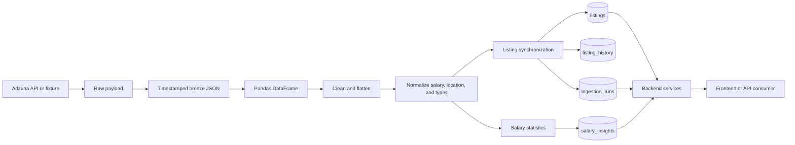
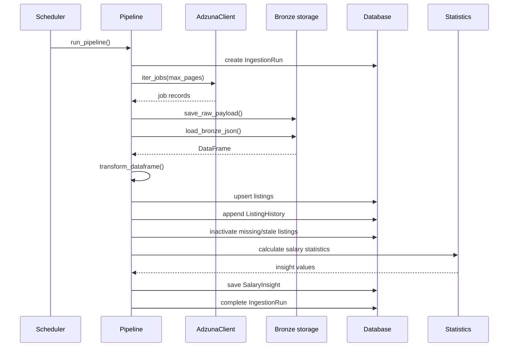
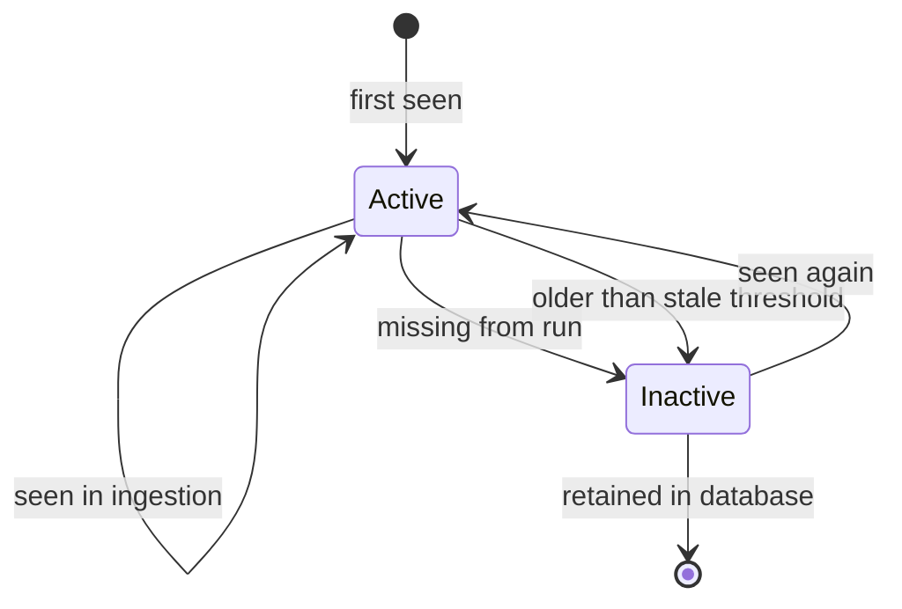
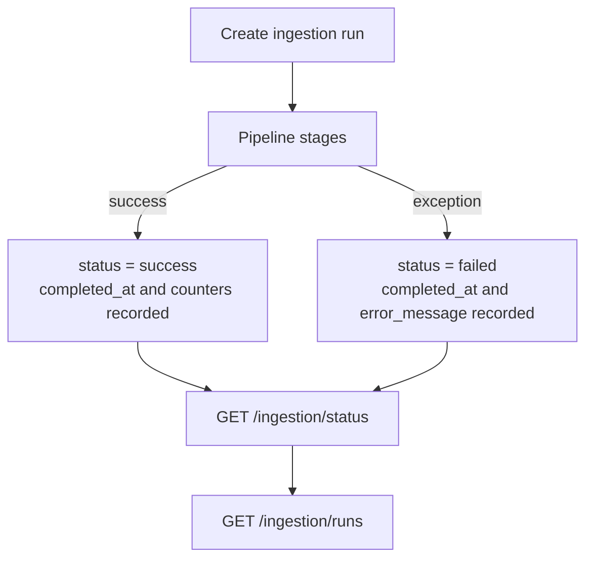

# Data Flow

This document follows a job dataset from extraction to API response. The pipeline preserves the source payload, creates a normalized current view, and records historical observations and analytical snapshots.

## End-to-end lineage

## Pipeline execution

[`run_pipeline`](../data_pipeline/services/pipeline.py) creates an ingestion run before extraction. The run is an operational audit record even if a later stage fails.

## Stage details

### 1. Extraction

The scheduled production path uses [`AdzunaClient`](../data_pipeline/clients/adzuna.py). `ADZUNA_MAX_PAGES` controls the page limit and `ADZUNA_MAX_JOBS`, when set, limits the number of collected records. A run fails if no jobs are returned.

The repository also contains [`ingest_mock.py`](../data_pipeline/services/ingest_mock.py) for loading `data/mock_jobs.json`, and [`ingest_adzuna.py`](../data_pipeline/services/ingest_adzuna.py) for a direct synchronization path. These helpers are useful for local work; the tracked, full-lifecycle path is `run_pipeline()`.

### 2. Bronze storage

[`save_raw_payload`](../data_pipeline/storage/raw.py) creates `data/bronze` and writes JSON using a UTC filename such as `adzuna_20260904T120000Z.json`. The payload is saved before loading or cleaning, so the original extraction can be inspected independently of later processing.

[`load_bronze_json`](../data_pipeline/storage/bronze_loader.py) supports:

- `{ "pages": [{ "results": [...] }] }`
- `{ "results": [...] }`
- a top-level list of job records

Unsupported JSON shapes raise `ValueError`.

### 3. Cleaning and transformation

The processing layer converts nested source data into database columns, removes or standardizes missing values, normalizes locations and salaries, and enforces values suitable for SQLAlchemy persistence. The normalized salary columns are `normalized_salary_min`, `normalized_salary_max`, and `normalized_salary_midpoint`.

### 4. Synchronization and lifecycle

Incoming records are deduplicated by `id`. Existing listings are updated and new listings are inserted with `first_seen_at`, `last_seen_at`, and `is_active=True`. Each observed record also creates a `ListingHistory` row linked to the current `IngestionRun`.

Listings not present in the current run are marked inactive. The stale-listing job also marks active records inactive when `last_seen_at` is older than `ADZUNA_STALE_AFTER_DAYS`. Records are retained for history rather than deleted.

### 5. Salary analysis

Salary statistics are calculated from normalized midpoint values. The pipeline stores a `SalaryInsight` snapshot containing counts, mean, median, minimum, maximum, standard deviation, quartiles, IQR, standard-deviation thresholds, outlier counts, and salary-range summaries.

The API salary endpoints read the latest snapshot by `created_at`; they do not recalculate the full pipeline snapshot on every request. Some category and distribution analytics are calculated live from active listings.

### 6. API reads and writes

Backend services read `Listing`, `SalaryInsight`, and `IngestionRun` through the shared SQLAlchemy engine. Job filters and analytics are read operations. The application PATCH endpoint updates tracking fields on `Listing`, including status, priority, follow-up time, and notes.

## Failure and observability path

The scheduler logs success or failure. The API exposes the same operational state through `/ingestion/status` and `/ingestion/runs`, while `/health` checks database availability and reports listing totals.

## Data ownership

| Data             | Written by                                       | Read by                                         |
| ---------------- | ------------------------------------------------ | ----------------------------------------------- |
| Bronze JSON      | `storage/raw.py`                                 | bronze loader and operators                     |
| Current listings | pipeline synchronization and application tracker | backend services and analytics                  |
| Listing history  | pipeline synchronization                         | database consumers and future history analytics |
| Salary insights  | pipeline salary insight service                  | analytics API                                   |
| Ingestion runs   | pipeline orchestration                           | system API and operators                        |
