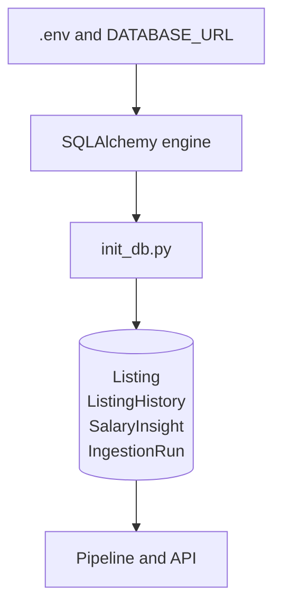
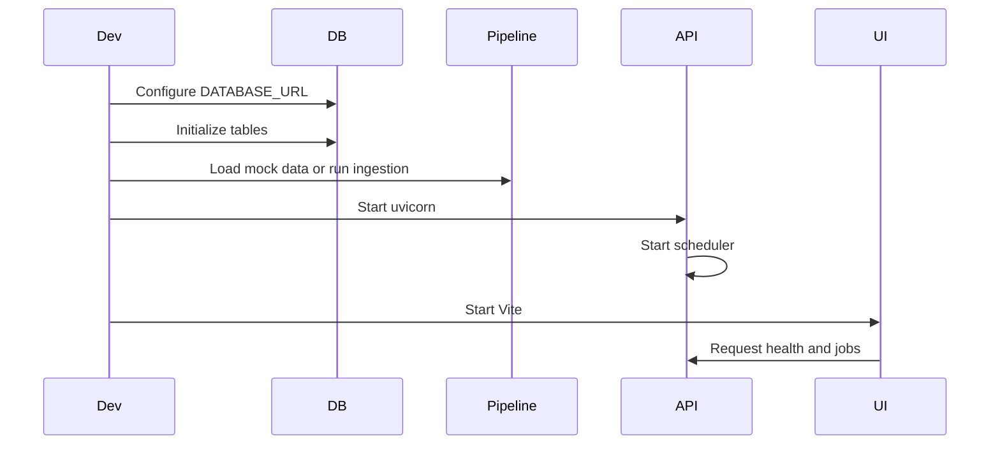

# Setup and Startup

This guide describes a local development setup from a clean checkout. Run Python commands from the repository root unless a command explicitly changes directory.

## Prerequisites

- Python 3.9 or newer
- `pip` and `venv` (or an equivalent Python environment manager)
- Node.js and npm for the frontend
- Adzuna credentials for live ingestion, or the repository mock fixture for local data work

## 1. Create the Python environment

```bash
python3 -m venv .venv
source .venv/bin/activate
python -m pip install --upgrade pip
```

Install the Python dependencies used by the application and tests according to the project’s dependency management. The repository currently keeps Ruff configuration in [`pyproject.toml`](../pyproject.toml); confirm the dependency installation source used by your branch before deploying.

## 2. Configure environment variables

Create a local `.env` file at the repository root. `data_pipeline/config.py` loads it through `python-dotenv`.

### Database and API configuration

| Variable       | Required | Default      | Purpose                              |
| -------------- | -------- | ------------ | ------------------------------------ |
| `DATABASE_URL` | Yes      | none         | SQLAlchemy connection URL            |
| `CORS_ORIGINS` | No       | `*` fallback | Comma-separated frontend/API origins |

### Adzuna configuration

| Variable                  | Required for live ingestion | Default                          |
| ------------------------- | --------------------------- | -------------------------------- |
| `ADZUNA_APP_ID`           | Yes                         | none                             |
| `ADZUNA_APP_KEY`          | Yes                         | none                             |
| `ADZUNA_COUNTRY`          | No                          | `gb`                             |
| `ADZUNA_BASE_URL`         | No                          | `https://api.adzuna.com/v1/api`  |
| `ADZUNA_RESULTS_PER_PAGE` | No                          | consumed by client configuration |
| `ADZUNA_MAX_JOBS`         | No                          | unlimited in `run_pipeline`      |
| `ADZUNA_MAX_PAGES`        | Yes for scheduled ingestion | used as the scheduler page limit |
| `ADZUNA_SORT_BY`          | No                          | consumed by client configuration |
| `ADZUNA_MAX_DAYS_OLD`     | No                          | consumed by client configuration |
| `ADZUNA_STALE_AFTER_DAYS` | No                          | `14`                             |
| `ADZUNA_ANALYSIS_VERSION` | Yes for scheduled ingestion | passed to the insight snapshot   |

For local work, keep credentials out of source control. A minimal configuration looks like:

```dotenv
DATABASE_URL=sqlite:///./data/ukjob.db
ADZUNA_APP_ID=your-app-id
ADZUNA_APP_KEY=your-app-key
ADZUNA_MAX_PAGES=3
ADZUNA_ANALYSIS_VERSION=2.3
ADZUNA_STALE_AFTER_DAYS=14
CORS_ORIGINS=http://localhost:5173
```

The exact database URL depends on the installed database driver and deployment.

## 3. Initialize the database

The models and initialization script are [`data_pipeline/database/models.py`](../data_pipeline/database/models.py) and [`data_pipeline/scripts/init_db.py`](../data_pipeline/scripts/init_db.py).

```bash
python -m data_pipeline.scripts.init_db
```

This creates tables if they do not already exist. Existing data is not a replacement for migrations; review `data_pipeline/database/migrations` when changing an established database.



## 4. Load data

### Full tracked pipeline

Use the orchestrator in [`data_pipeline/services/pipeline.py`](../data_pipeline/services/pipeline.py) from a script, Python shell, or scheduler. It fetches Adzuna data, writes a bronze snapshot, transforms records, synchronizes listings and history, saves a salary insight, and records run counters.

The scheduler invokes this same flow daily at 02:00 UTC when the backend is running.

### Mock data

For a fixture-based local database:

```bash
python -m data_pipeline.services.ingest_mock
```

The fixture path is currently `data/mock_jobs.json`. This helper is intended for quick local loading; it does not provide the full ingestion-run and history tracking behavior of `run_pipeline()`.

## 5. Start the backend

From the repository root:

```bash
uvicorn backend.main:app --reload
```

The API is normally available at `http://localhost:8000`. Useful checks:

```bash
curl http://localhost:8000/health
curl http://localhost:8000/jobs
```

OpenAPI interfaces are available at `/docs`, `/redoc`, and `/openapi.json`.

Starting the backend also starts the background scheduler. Use one API process for local development; multiple worker processes need an explicit scheduler deployment strategy to avoid duplicate scheduled ingestion.

## 6. Start the frontend

In a second terminal:

```bash
cd frontend
npm install
npm run dev
```

Vite normally serves the UI at `http://localhost:5173`. Set the frontend API base URL according to the current frontend configuration and ensure that origin is listed in `CORS_ORIGINS` when CORS restrictions are enabled.

Available checks:

```bash
npm run lint
npm run typecheck
npm run build
```

## Recommended startup order



1. Activate the Python environment.
2. Create `.env` and configure `DATABASE_URL`.
3. Initialize the database.
4. Load mock data or run a live pipeline ingestion.
5. Start the backend.
6. Start the frontend.
7. Check `/health`, `/jobs`, and the browser UI.

## Troubleshooting

### Database connection errors

Check that `DATABASE_URL` is present, points to an accessible database, and has the required SQLAlchemy driver installed. The API health endpoint returns `503` when its database session cannot be opened or queried.

### Empty jobs or analytics responses

The API reads persisted data; it does not trigger ingestion on request. Run an ingestion or load the fixture first. Salary summary endpoints require at least one persisted `SalaryInsight` record, while salary distribution requires active listings with normalized midpoint values.

### Scheduled ingestion does not run

Confirm that the backend process is still running and that `ADZUNA_MAX_PAGES` and `ADZUNA_ANALYSIS_VERSION` are configured. The schedule is 02:00 UTC, not local time, and only one instance is allowed per scheduler.

### CORS failures

Set `CORS_ORIGINS` to the exact frontend origin, for example `http://localhost:5173`. Values are split on commas by the configuration module.

## Validation

From the repository root:

```bash
python -m pytest data_pipeline/tests
python -m compileall -q backend data_pipeline
```

From `frontend/`:

```bash
npm run lint
npm run typecheck
npm run build
```
